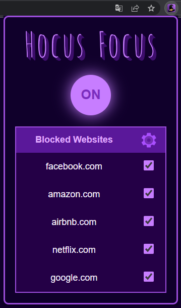
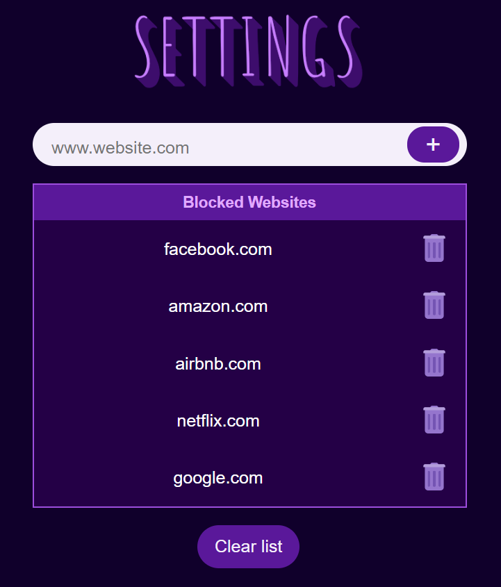

<!-- Replace [LOGO_URL] with the URL of your extension's logo -->

# ***Hocus Focus*** (v 0.1)

> **Hocus Focus**\
> *Help yourself focus by blocking time-wasting websites!*

Hocus Focus is a Chrome extension that allows users to block distracting domains to improve productivity and focus.

---
## **Features**

- Block specific domains to avoid distractions while browsing.
- Simple and intuitive options page to manage the list of blocked domains.
- Real-time updates of the blocked domains list.
---
## **Screenshots**

| Popup | Options Page | Blocked Page |
|---|---|---|
|  |  |  |

---
## **Installation** (developer mode)
1. Clone or download this repository to your local machine.
2. Open Google Chrome and navigate to `chrome://extensions`.
3. Enable the "Developer mode" toggle at the top right corner of the page.
4. Click on "Load unpacked" and select the folder containing the extension files.

---

**Note**: This is the very first version of the extension. Please keep in mind that it may have limitations and is a work in progress.

## **Suggestions and feedback are welcome!**